<!--
  ======================================================================
  DURVANKUR JOSHI — OFFICIAL GITHUB PROFILE README
  AI Engineer × Full-Stack Developer × Web3 Builder × Hackathon Developer
  ======================================================================
-->

<!-- ====================================================================== -->
<!-- 01. HERO SECTION                                                       -->
<!-- ====================================================================== -->

  

<!-- ACTION HUDS & SOCIALS -->

  
  &nbsp;
  
  &nbsp;
  
  &nbsp;
  

<!-- SECTION DIVIDER -->
  

 

<!-- ====================================================================== -->
<!-- 02. ABOUT ME                                                           -->
<!-- ====================================================================== -->

## 👨‍💻 About Me

- 🎓 **Computer Engineering student** passionate about building scalable, production-grade applications.
- 🤖 **AI & Full-Stack developer** specializing in **Agentic AI**, **Generative AI**, and **Web3 architectures**.
- 🏆 **Hackathon builder** with a proven track record of shipping end-to-end solutions under tight deadlines.
- 💡 Focused on turning complex technical concepts into robust, intuitive, and user-centric products.

 

 

 

<!-- ====================================================================== -->
<!-- 03. WHAT I BUILD                                                       -->
<!-- ====================================================================== -->

## ⚡ What I Build

<table align="center" width="100%">
  <tr>
    <td width="50%" bgcolor="#050816" style="border: 1px solid #1f2d6e; border-radius: 8px; padding: 16px; vertical-align: top;">
      <h3 style="color: #00F7FF; margin-top: 0;">🤖 Agentic AI</h3>
      

        AI agents, LLM workflows, RAG systems, tool calling and intelligent automation.
      

    </td>
    <td width="50%" bgcolor="#050816" style="border: 1px solid #1f2d6e; border-radius: 8px; padding: 16px; vertical-align: top;">
      <h3 style="color: #00FFA3; margin-top: 0;">🧠 Generative AI</h3>
      

        LLM applications, embeddings, semantic search and AI-powered products.
      

    </td>
  </tr>
  <tr>
    <td width="50%" bgcolor="#050816" style="border: 1px solid #1f2d6e; border-radius: 8px; padding: 16px; vertical-align: top;">
      <h3 style="color: #F5F7FF; margin-top: 0;">🌐 Full-Stack Applications</h3>
      

        React / Next.js frontends with FastAPI / Node.js backends and databases.
      

    </td>
    <td width="50%" bgcolor="#050816" style="border: 1px solid #1f2d6e; border-radius: 8px; padding: 16px; vertical-align: top;">
      <h3 style="color: #7F00FF; margin-top: 0;">⛓️ Web3 Applications</h3>
      

        Smart contracts, blockchain, wallet integration and decentralized systems.
      

    </td>
  </tr>
</table>

 

 

 

<!-- ====================================================================== -->
<!-- 04. DEVELOPER STATUS PANEL                                             -->
<!-- ====================================================================== -->

## 🧩 Developer Status

<table align="center" width="100%">
  <tr>
    <td bgcolor="#050816" style="border: 1px solid #1f2d6e; border-radius: 8px; padding: 18px;">
      <table width="100%" style="border-collapse: collapse;">
        <tr>
          <td width="20%" style="color: #00F7FF; font-weight: bold; padding: 4px 0;">Role:</td>
          <td width="80%" style="color: #F5F7FF; padding: 4px 0;">AI / Full-Stack Developer</td>
        </tr>
        <tr>
          <td style="color: #00FFA3; font-weight: bold; padding: 4px 0;">Focus:</td>
          <td style="color: #F5F7FF; padding: 4px 0;">Agentic AI + Gen AI + Web3</td>
        </tr>
        <tr>
          <td style="color: #00F7FF; font-weight: bold; padding: 4px 0;">Building:</td>
          <td style="color: #F5F7FF; padding: 4px 0;">AI-powered products and hackathon projects</td>
        </tr>
        <tr>
          <td style="color: #7F00FF; font-weight: bold; padding: 4px 0;">Learning:</td>
          <td style="color: #F5F7FF; padding: 4px 0;">Advanced AI Engineering + Blockchain</td>
        </tr>
        <tr>
          <td style="color: #00FFA3; font-weight: bold; padding: 4px 0;">Status:</td>
          <td style="color: #00FFA3; font-weight: bold; padding: 4px 0;">Building 🚀</td>
        </tr>
      </table>
    </td>
  </tr>
</table>

 

 

 

<!-- ====================================================================== -->
<!-- 05. TECH STACK                                                         -->
<!-- ====================================================================== -->

## 🛠️ Tech Stack

<table align="center" width="100%">
  <tr>
    <th width="26%" align="left" style="color: #00F7FF;">CATEGORY</th>
    <th width="74%" align="left" style="color: #00FFA3;">TECHNOLOGIES &amp; TOOLS</th>
  </tr>
  <tr>
    <td align="left"><b>💻 Languages</b></td>
    <td align="left">
      
    </td>
  </tr>
  <tr>
    <td align="left"><b>🧠 AI / ML</b></td>
    <td align="left">
      
      
      
      
      
      
      
      
      
    </td>
  </tr>
  <tr>
    <td align="left"><b>🎨 Frontend</b></td>
    <td align="left">
      
    </td>
  </tr>
  <tr>
    <td align="left"><b>⚙️ Backend</b></td>
    <td align="left">
      
    </td>
  </tr>
  <tr>
    <td align="left"><b>🗄️ Database / Cloud</b></td>
    <td align="left">
      
    </td>
  </tr>
  <tr>
    <td align="left"><b>⛓️ Web3</b></td>
    <td align="left">
      
      
      
      
      
    </td>
  </tr>
  <tr>
    <td align="left"><b>🛠️ Tools</b></td>
    <td align="left">
      
    </td>
  </tr>
</table>

 

 

 

<!-- ====================================================================== -->
<!-- 06. FEATURED PROJECTS                                                  -->
<!-- ====================================================================== -->

## 🚀 Featured Projects

<!-- PROJECT 1: MEDVAULT -->
<table width="100%">
  <tr>
    <td bgcolor="#050816" style="border-left: 4px solid #7F00FF; border-top: 1px solid #1f2d6e; border-right: 1px solid #1f2d6e; border-bottom: 1px solid #1f2d6e; border-radius: 8px; padding: 18px;">
      <h3 style="margin-top: 0;"><a href="https://github.com/Durvankur-Joshi/medvault" style="color: #00FFA3; text-decoration: none;">01. MedVault — Decentralized Medical History Ledger</a></h3>
      

        Privacy-first medical record sharing using blockchain, patient consent and zero-knowledge concepts.
      

      

        <code>Next.js</code> &bull; <code>FastAPI</code> &bull; <code>PostgreSQL</code> &bull; <code>Supabase</code> &bull; <code>Solidity</code> &bull; <code>Ethereum</code> &bull; <code>ZK</code>
      

      

        
        
      

    </td>
  </tr>
</table>

 

<!-- PROJECT 2: AI DEBUGGING AGENT -->
<table width="100%">
  <tr>
    <td bgcolor="#050816" style="border-left: 4px solid #00F7FF; border-top: 1px solid #1f2d6e; border-right: 1px solid #1f2d6e; border-bottom: 1px solid #1f2d6e; border-radius: 8px; padding: 18px;">
      <h3 style="margin-top: 0;"><a href="https://github.com/Durvankur-Joshi/ai-debugging-agent" style="color: #00F7FF; text-decoration: none;">02. AI Debugging Agent</a></h3>
      

        AI-powered debugging system that understands repositories, retrieves relevant code and helps diagnose errors.
      

      

        <code>Python</code> &bull; <code>FastAPI</code> &bull; <code>LangGraph</code> &bull; <code>LangChain</code> &bull; <code>Hugging Face</code> &bull; <code>pgvector</code>
      

      

        
      

    </td>
  </tr>
</table>

 

<!-- PROJECT 3: AI SOFTWARE COMPILER -->
<table width="100%">
  <tr>
    <td bgcolor="#050816" style="border-left: 4px solid #00FFA3; border-top: 1px solid #1f2d6e; border-right: 1px solid #1f2d6e; border-bottom: 1px solid #1f2d6e; border-radius: 8px; padding: 18px;">
      <h3 style="margin-top: 0;"><a href="https://github.com/Durvankur-Joshi/ai-software-compiler" style="color: #00FFA3; text-decoration: none;">03. AI Software Compiler</a></h3>
      

        Transforms natural-language software requirements into structured application architecture.
      

      

        <code>Python</code> &bull; <code>FastAPI</code> &bull; <code>LLMs</code> &bull; <code>Pydantic</code> &bull; <code>Supabase</code>
      

      

        
      

    </td>
  </tr>
</table>

 

<!-- PROJECT 4 & 5 GRID -->
<table width="100%">
  <tr>
    <!-- CHATFUSION -->
    <td width="50%" bgcolor="#050816" style="border-top: 1px solid #1f2d6e; border-right: 1px solid #1f2d6e; border-bottom: 1px solid #1f2d6e; border-left: 3px solid #00F7FF; border-radius: 8px; padding: 16px; vertical-align: top;">
      <h4 style="margin-top: 0;"><a href="https://github.com/Durvankur-Joshi/chatfusion" style="color: #00F7FF; text-decoration: none;">04. ChatFusion</a></h4>
      
Real-time chat application with interactive messaging.

      
<code>MERN</code> &bull; <code>Socket.IO</code>

      
    </td>
    <!-- CODEX -->
    <td width="50%" bgcolor="#050816" style="border-top: 1px solid #1f2d6e; border-right: 1px solid #1f2d6e; border-bottom: 1px solid #1f2d6e; border-left: 3px solid #7F00FF; border-radius: 8px; padding: 16px; vertical-align: top;">
      <h4 style="margin-top: 0;"><a href="https://github.com/Durvankur-Joshi/codex" style="color: #00FFA3; text-decoration: none;">05. CodeX</a></h4>
      
Browser-based online coding environment.

      
<code>React</code> &bull; <code>Node.js</code> &bull; <code>Express</code>

      
    </td>
  </tr>
</table>

 

 

 

<!-- ====================================================================== -->
<!-- 07. HACKATHONS & ACHIEVEMENTS                                          -->
<!-- ====================================================================== -->

## 🏆 Hackathons & Achievements

<table align="center" width="100%">
  <tr>
    <td bgcolor="#050816" style="border: 1px solid #1f2d6e; border-radius: 8px; padding: 18px;">
      <table width="100%" style="border-collapse: collapse;">
        <tr>
          <td width="8%" align="center" valign="middle"><h2>🥇</h2></td>
          <td width="92%">
            <h4 style="margin: 0; color: #FFD700;">Web Wizard Hackathon &bull; Winner</h4>
            

              Awarded 1st place for designing and building an end-to-end full-stack software prototype under timed hackathon conditions.
            

          </td>
        </tr>
        <tr><td colspan="2">
</td></tr>
        <tr>
          <td width="8%" align="center" valign="middle"><h2>🌐</h2></td>
          <td width="92%">
            <h4 style="margin: 0; color: #00F7FF;">HackNexus'26 &bull; Building MedVault</h4>
            

              Competed in Domain: Web3 &amp; Decentralized Applications, developing a Zero-Knowledge sovereign medical history ledger.
            

          </td>
        </tr>
        <tr><td colspan="2">
</td></tr>
        <tr>
          <td width="8%" align="center" valign="middle"><h2>🛡️</h2></td>
          <td width="92%">
            <h4 style="margin: 0; color: #00FFA3;">Web Development Domain Head &bull; Hackathon Club</h4>
            

              Leading technical workshops, guiding full-stack architecture, and mentoring student developer teams for hackathons.
            

          </td>
        </tr>
      </table>
    </td>
  </tr>
</table>

 

 

 

<!-- ====================================================================== -->
<!-- 08. GAMIFIED CONTRIBUTION SECTION                                      -->
<!-- ====================================================================== -->

## 🐍 Contribution Game

<picture>
  <source media="(prefers-color-scheme: dark)" srcset="https://raw.githubusercontent.com/Durvankur-Joshi/Durvankur-Joshi/output/github-contribution-grid-snake-dark.svg">
  <source media="(prefers-color-scheme: light)" srcset="https://raw.githubusercontent.com/Durvankur-Joshi/Durvankur-Joshi/output/github-contribution-grid-snake.svg">
  
</picture>

  

<!-- ====================================================================== -->
<!-- 09. GITHUB ANALYTICS                                                   -->
<!-- ====================================================================== -->

## 📊 GitHub Analytics

<table align="center" width="100%">
  <tr>
    <td width="50%" align="center" valign="top">
      
    </td>
    <td width="50%" align="center" valign="top">
      
    </td>
  </tr>
  <tr>
    <td colspan="2" align="center">
      
    </td>
  </tr>
</table>

 

<!-- ====================================================================== -->
<!-- 10. CONTRIBUTION ACTIVITY GRAPH                                        -->
<!-- ====================================================================== -->

## 📈 Activity Graph

  

  

 

<!-- ====================================================================== -->
<!-- 11. CURRENTLY EXPLORING                                                -->
<!-- ====================================================================== -->

## 🎯 Currently Exploring

<table align="center" width="100%">
  <tr>
    <td width="33%" bgcolor="#050816" style="border: 1px solid #1f2d6e; border-radius: 8px; padding: 14px;">
      <b style="color: #00F7FF;">🤖 Agentic AI</b>
      
Autonomous agent swarms &amp; tool calling

    </td>
    <td width="33%" bgcolor="#050816" style="border: 1px solid #1f2d6e; border-radius: 8px; padding: 14px;">
      <b style="color: #00FFA3;">🔍 Advanced RAG</b>
      
Hybrid dense-sparse vector retrieval

    </td>
    <td width="33%" bgcolor="#050816" style="border: 1px solid #1f2d6e; border-radius: 8px; padding: 14px;">
      <b style="color: #7F00FF;">📊 LangGraph</b>
      
Cyclic state graphs &amp; self-evaluating loops

    </td>
  </tr>
  <tr>
    <td width="33%" bgcolor="#050816" style="border: 1px solid #1f2d6e; border-radius: 8px; padding: 14px;">
      <b style="color: #F5F7FF;">🏗️ LLM App Architecture</b>
      
Scalable inference &amp; memory layers

    </td>
    <td width="33%" bgcolor="#050816" style="border: 1px solid #1f2d6e; border-radius: 8px; padding: 14px;">
      <b style="color: #00F7FF;">⛓️ Web3</b>
      
EVM protocols &amp; smart contracts

    </td>
    <td width="33%" bgcolor="#050816" style="border: 1px solid #1f2d6e; border-radius: 8px; padding: 14px;">
      <b style="color: #00FFA3;">🔐 Zero-Knowledge Proofs</b>
      
Privacy-preserving cryptographic circuits

    </td>
  </tr>
</table>

 

 

 

<!-- ====================================================================== -->
<!-- 12. FOOTER & CONNECT                                                   -->
<!-- ====================================================================== -->

## 📬 Let's Connect

<strong>Let's build something interesting.</strong>

 

  
  &nbsp;
  
  &nbsp;
  
  &nbsp;
  

 

<!-- SUBTLE TERMINAL SESSION STATUS -->
<table align="center">
  <tr>
    <td bgcolor="#050816" align="center" style="border: 1px solid #1f2d6e; border-radius: 20px; padding: 6px 20px;">
      
        ● SYS.SESSION_ACTIVE // DURVANKUR JOSHI // 2026
      
    </td>
  </tr>
</table>

 

  

