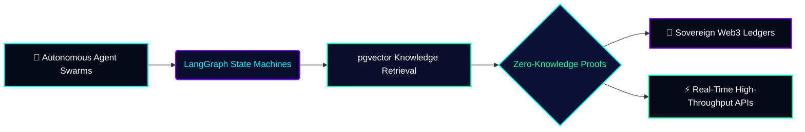

<!--
  ======================================================================
  DURVANKUR JOSHI — OFFICIAL GITHUB PROFILE README
  AI Engineer × Web3 Builder × Hackathon Developer
  ======================================================================
-->

<div align="center">

<!-- ====================================================================== -->
<!-- 01. HERO SECTION                                                       -->
<!-- ====================================================================== -->

<a href="https://github.com/YOUR_GITHUB_USERNAME">
  
</a>

<br><br>

<!-- QUICK ACTION BUTTONS -->
<p align="center">
  <a href="https://linkedin.com/in/YOUR_LINKEDIN" target="_blank">
    
  </a>
  &nbsp;
  <a href="https://YOUR_PORTFOLIO" target="_blank">
    
  </a>
  &nbsp;
  <a href="mailto:YOUR_EMAIL">
    
  </a>
  &nbsp;
  <a href="https://github.com/YOUR_GITHUB_USERNAME?tab=repositories">
    
  </a>
</p>

<!-- SECTION DIVIDER -->


</div>

<br>

<!-- ====================================================================== -->
<!-- 02. ABOUT ME                                                           -->
<!-- ====================================================================== -->

<div align="center">

## 👨‍💻 About Me

</div>

<table align="center" width="100%">
  <tr>
    <td bgcolor="#050816" style="border: 1px solid #1f2d6e; border-radius: 12px; padding: 24px;">

```yaml
# 👨‍💻 DEVELOPER TELEMETRY & WHOAMI
identity:
  name: "Durvankur Joshi"
  roles:
    - "AI Engineer (Agentic Workflows, LangGraph, RAG, pgvector)"
    - "Full-Stack Developer (Next.js, React, FastAPI, Node.js)"
    - "Web3 & ZK Developer (Solidity, Ethereum, Zero-Knowledge Proofs)"
  education: "Computer Engineering Student"
  leadership: "Web Development Domain Head // College Hackathon Club"
  achievements: "🏆 Winner — Web Wizard Hackathon"

mission_parameters:
  core_philosophy: "Building autonomous cognitive AI systems and sovereign decentralized protocols."
  current_focus: "Multi-agent self-correcting execution graphs & pgvector retrieval pipelines."
  collaboration: "Open to High-Impact AI/Web3 Roles, Research Labs & Hackathon Squads."
```

  </td>
</tr>
</table>

<br>

<div align="center">
  
</div>

<br>

<!-- ====================================================================== -->
<!-- 03. WHAT I BUILD                                                       -->
<!-- ====================================================================== -->

<div align="center">

## 🛠️ What I Build

<p><em>Architecting autonomous intelligence, sovereign ledgers, and distributed systems</em></p>

</div>



<table align="center" width="100%">
  <tr>
    <td width="33%" bgcolor="#050816" style="border: 1px solid #1f2d6e; border-radius: 8px; padding: 18px; vertical-align: top;">
      <h4 style="color: #00F7FF; margin-top: 0;">🧠 Autonomous AI Systems</h4>
      <p style="font-size: 13.5px; color: #CBD5E1; line-height: 1.6;">
        Multi-agent cognitive loops using <b>LangGraph</b> and <b>LangChain</b> that inspect execution environments, self-correct errors, and execute complex workflows deterministically.
      </p>
    </td>
    <td width="33%" bgcolor="#050816" style="border: 1px solid #1f2d6e; border-radius: 8px; padding: 18px; vertical-align: top;">
      <h4 style="color: #7F00FF; margin-top: 0;">🔐 Sovereign Web3 &amp; ZK</h4>
      <p style="font-size: 13.5px; color: #CBD5E1; line-height: 1.6;">
        Decentralized ledgers and <b>Solidity smart contracts</b> integrating <b>Zero-Knowledge proof concepts</b> to preserve user privacy and data sovereignty without central authorities.
      </p>
    </td>
    <td width="33%" bgcolor="#050816" style="border: 1px solid #1f2d6e; border-radius: 8px; padding: 18px; vertical-align: top;">
      <h4 style="color: #00FFA3; margin-top: 0;">⚡ High-Throughput Full-Stack</h4>
      <p style="font-size: 13.5px; color: #CBD5E1; line-height: 1.6;">
        Event-driven real-time architectures with <b>Next.js</b>, <b>FastAPI</b>, and <b>WebSockets</b> coupled with low-latency <b>pgvector</b> semantic search indexes.
      </p>
    </td>
  </tr>
</table>

<br>

<div align="center">
  
</div>

<br>

<!-- ====================================================================== -->
<!-- 04. TECH STACK                                                         -->
<!-- ====================================================================== -->

<div align="center">

## ⚡ Tech Stack & 3D Orbital Matrix

<p><em>Interactive 3D SVG orbital system modeling active core runtime technologies</em></p>

<!-- 3D SPHERE EMBED -->
<a href="#-tech-stack--3d-orbital-matrix">
  
</a>

<br><br>

### 🧰 Categorized Skill Arsenal

</div>

<table align="center" width="100%">
  <tr>
    <th width="28%" align="left" style="color: #00F7FF;">DOMAIN</th>
    <th width="72%" align="left" style="color: #00FFA3;">STACK &amp; TOOLS</th>
  </tr>
  <tr>
    <td align="left">
      <b>🧠 AI, Agents &amp; Vector Search</b>
    </td>
    <td align="left">
      
      
      
      
      
      
      
      
      
    </td>
  </tr>
  <tr>
    <td align="left">
      <b>🌐 Web3 &amp; Cryptography</b>
    </td>
    <td align="left">
      
      
      
      
      
      
    </td>
  </tr>
  <tr>
    <td align="left">
      <b>💻 Frontend Architecture</b>
    </td>
    <td align="left">
      
      
      
      
      
      
    </td>
  </tr>
  <tr>
    <td align="left">
      <b>⚙️ Backend &amp; Distributed APIs</b>
    </td>
    <td align="left">
      
      
      
      
      
      
    </td>
  </tr>
  <tr>
    <td align="left">
      <b>🗄️ Databases &amp; Vector Stores</b>
    </td>
    <td align="left">
      
      
      
      
      
    </td>
  </tr>
  <tr>
    <td align="left">
      <b>🛠️ DevOps, Cloud &amp; Tooling</b>
    </td>
    <td align="left">
      
      
      
      
      
      
    </td>
  </tr>
</table>

<br>

<div align="center">
  
</div>

<br>

<!-- ====================================================================== -->
<!-- 05. FEATURED PROJECTS                                                  -->
<!-- ====================================================================== -->

<div align="center">

## 🚀 Featured Projects

<p><em>Flagship production systems, autonomous agents, and decentralized protocols</em></p>

</div>

<!-- PROJECT 1: AI DEBUGGING AGENT -->
<table width="100%">
  <tr>
    <td bgcolor="#050816" style="border-left: 4px solid #00F7FF; border-top: 1px solid #1f2d6e; border-right: 1px solid #1f2d6e; border-bottom: 1px solid #1f2d6e; border-radius: 8px; padding: 18px;">
      <h3 style="margin-top: 0;"><a href="https://github.com/YOUR_GITHUB_USERNAME/ai-debugging-agent" style="color: #00F7FF; text-decoration: none;">01. AI Debugging Agent</a></h3>
      <p><strong>Autonomous multi-agent runtime for real-time code execution debugging, AST introspection, and contextual doc retrieval.</strong></p>
      <ul>
        <li>Orchestrates cyclic reasoning graphs with <b>LangGraph</b> and <b>LangChain</b> to isolate runtime exceptions, test patches, and iteratively verify fixes.</li>
        <li>Integrates <b>Supabase pgvector</b> for semantic search across language documentation, historical stack traces, and test corpora.</li>
        <li>Exposes a high-speed async <b>FastAPI</b> backend connected with <b>Hugging Face</b> inference models for code understanding.</li>
      </ul>
      <p>
        <code>Python</code> &bull; <code>FastAPI</code> &bull; <code>LangGraph</code> &bull; <code>LangChain</code> &bull; <code>Hugging Face</code> &bull; <code>Supabase pgvector</code>
      </p>
      <p>
        <a href="https://github.com/YOUR_GITHUB_USERNAME/ai-debugging-agent"></a>
        <a href="https://YOUR_PORTFOLIO"></a>
      </p>
    </td>
  </tr>
</table>

<br>

<!-- PROJECT 2: MEDVAULT -->
<table width="100%">
  <tr>
    <td bgcolor="#050816" style="border-left: 4px solid #7F00FF; border-top: 1px solid #1f2d6e; border-right: 1px solid #1f2d6e; border-bottom: 1px solid #1f2d6e; border-radius: 8px; padding: 18px;">
      <h3 style="margin-top: 0;"><a href="https://github.com/YOUR_GITHUB_USERNAME/medvault" style="color: #00FFA3; text-decoration: none;">02. MedVault — Decentralized Medical History Ledger</a></h3>
      <p><strong>Sovereign, patient-owned electronic health record protocol leveraging Zero-Knowledge verification on Ethereum.</strong></p>
      <ul>
        <li>Engineered <b>Solidity smart contracts</b> enabling role-based, cryptographically governed record access with zero central point of failure.</li>
        <li>Implemented <b>Zero-Knowledge proof concepts</b> allowing patients to verify medical eligibility without disclosing raw diagnoses.</li>
        <li>Constructed a responsive <b>Next.js</b> patient portal coupled with a high-throughput <b>FastAPI</b> &amp; <b>PostgreSQL/Supabase</b> backend.</li>
      </ul>
      <p>
        <code>Next.js</code> &bull; <code>FastAPI</code> &bull; <code>PostgreSQL</code> &bull; <code>Supabase</code> &bull; <code>Solidity</code> &bull; <code>Ethereum</code> &bull; <code>Zero-Knowledge</code>
      </p>
      <p>
        <a href="https://github.com/YOUR_GITHUB_USERNAME/medvault"></a>
        <a href="https://YOUR_PORTFOLIO"></a>
      </p>
    </td>
  </tr>
</table>

<br>

<!-- PROJECT 3: AI SOFTWARE COMPILER -->
<table width="100%">
  <tr>
    <td bgcolor="#050816" style="border-left: 4px solid #00FFA3; border-top: 1px solid #1f2d6e; border-right: 1px solid #1f2d6e; border-bottom: 1px solid #1f2d6e; border-radius: 8px; padding: 18px;">
      <h3 style="margin-top: 0;"><a href="https://github.com/YOUR_GITHUB_USERNAME/ai-software-compiler" style="color: #00F7FF; text-decoration: none;">03. AI Software Compiler</a></h3>
      <p><strong>Generative software architecture compiler synthesizing end-to-end multi-tier application scaffolds from natural language intent.</strong></p>
      <ul>
        <li>Transforms high-level business specs into full relational DB schemas, OpenAPI specs, and modular frontend/backend scaffolds.</li>
        <li>Employs deterministic AST verification layers to eliminate hallucinated syntax in generated microservices.</li>
      </ul>
      <p>
        <code>Python</code> &bull; <code>LangChain</code> &bull; <code>Gemini</code> &bull; <code>OpenAI</code> &bull; <code>FastAPI</code> &bull; <code>Next.js</code>
      </p>
      <p>
        <a href="https://github.com/YOUR_GITHUB_USERNAME/ai-software-compiler"></a>
      </p>
    </td>
  </tr>
</table>

<br>

<!-- PROJECT 4 & 5 GRID -->
<table width="100%">
  <tr>
    <!-- CHATFUSION -->
    <td width="50%" bgcolor="#050816" style="border-top: 1px solid #1f2d6e; border-right: 1px solid #1f2d6e; border-bottom: 1px solid #1f2d6e; border-left: 3px solid #00F7FF; border-radius: 8px; padding: 16px; vertical-align: top;">
      <h4 style="margin-top: 0;"><a href="https://github.com/YOUR_GITHUB_USERNAME/chatfusion" style="color: #00F7FF; text-decoration: none;">04. ChatFusion</a></h4>
      <p><strong>Real-time distributed chat system engineered with MERN and Socket.IO.</strong></p>
      <p>Features sub-50ms message propagation, room clustering, dynamic presence telemetry, and encrypted persistent messaging with MongoDB.</p>
      <p><code>React</code> &bull; <code>Node.js</code> &bull; <code>Express.js</code> &bull; <code>Socket.IO</code> &bull; <code>MongoDB</code> &bull; <code>Tailwind CSS</code></p>
      <a href="https://github.com/YOUR_GITHUB_USERNAME/chatfusion"></a>
    </td>
    <!-- CODEX -->
    <td width="50%" bgcolor="#050816" style="border-top: 1px solid #1f2d6e; border-right: 1px solid #1f2d6e; border-bottom: 1px solid #1f2d6e; border-left: 3px solid #7F00FF; border-radius: 8px; padding: 16px; vertical-align: top;">
      <h4 style="margin-top: 0;"><a href="https://github.com/YOUR_GITHUB_USERNAME/codex-ide" style="color: #00FFA3; text-decoration: none;">05. CodeX — Online Code IDE</a></h4>
      <p><strong>Cloud-native collaborative in-browser code editor and multi-runtime execution engine.</strong></p>
      <p>Built with Monaco Editor, Dockerized sandbox execution containers, live terminal output streaming, and syntax auto-completion.</p>
      <p><code>React</code> &bull; <code>Node.js</code> &bull; <code>Docker</code> &bull; <code>WebSockets</code> &bull; <code>Monaco</code> &bull; <code>Express</code></p>
      <a href="https://github.com/YOUR_GITHUB_USERNAME/codex-ide"></a>
    </td>
  </tr>
</table>

<br>

<div align="center">
  
</div>

<br>

<!-- ====================================================================== -->
<!-- 06. HACKATHON / ACHIEVEMENTS                                           -->
<!-- ====================================================================== -->

<div align="center">

## 🏆 Hackathons & Achievements

</div>

<table align="center" width="100%">
  <tr>
    <td bgcolor="#050816" style="border: 1px solid #1f2d6e; border-radius: 10px; padding: 20px;">
      <table width="100%" style="border-collapse: collapse;">
        <tr>
          <td width="10%" align="center" valign="middle">
            <h2>🥇</h2>
          </td>
          <td width="90%">
            <h4 style="margin: 0; color: #FFD700;">WINNER &bull; WEB WIZARD HACKATHON</h4>
            <p style="margin: 4px 0 0 0; color: #E0E7FF; font-size: 14px;">
              Designed, built, and pitched an end-to-end full-stack solution under intense timed pressure, earning 1st place among competing collegiate and developer teams.
            </p>
          </td>
        </tr>
        <tr><td colspan="2"><hr style="border: none; border-top: 1px solid #15224e; margin: 12px 0;"></td></tr>
        <tr>
          <td width="10%" align="center" valign="middle">
            <h2>🛡️</h2>
          </td>
          <td width="90%">
            <h4 style="margin: 0; color: #00F7FF;">WEB DEVELOPMENT DOMAIN HEAD &bull; COLLEGE HACKATHON CLUB</h4>
            <p style="margin: 4px 0 0 0; color: #E0E7FF; font-size: 14px;">
              Spearheading developer initiatives, conducting architectural workshops on modern full-stack systems, and mentoring 50+ junior developers for hackathons.
            </p>
          </td>
        </tr>
        <tr><td colspan="2"><hr style="border: none; border-top: 1px solid #15224e; margin: 12px 0;"></td></tr>
        <tr>
          <td width="10%" align="center" valign="middle">
            <h2>🚀</h2>
          </td>
          <td width="90%">
            <h4 style="margin: 0; color: #00FFA3;">NATIONAL-LEVEL HACKATHON COMPETITOR</h4>
            <p style="margin: 4px 0 0 0; color: #E0E7FF; font-size: 14px;">
              Active competitor in premier national 24-36hr hackathons, rapidly shipping novel prototypes in Agentic AI, Zero-Knowledge verification, and high-performance Web applications.
            </p>
          </td>
        </tr>
      </table>
    </td>
  </tr>
</table>

<br>

<div align="center">
  
</div>

<br>

<!-- ====================================================================== -->
<!-- 07. GITHUB CONTRIBUTIONS                                               -->
<!-- ====================================================================== -->

<div align="center">

## 🎮 GitHub Contributions

<p><em>Autonomous contribution trajectory eating daily commits across repositories</em></p>

<!-- CONTRIBUTION SNAKE -->
<picture>
  <source media="(prefers-color-scheme: dark)" srcset="https://raw.githubusercontent.com/YOUR_GITHUB_USERNAME/YOUR_GITHUB_USERNAME/output/github-contribution-grid-snake-dark.svg">
  <source media="(prefers-color-scheme: light)" srcset="https://raw.githubusercontent.com/YOUR_GITHUB_USERNAME/YOUR_GITHUB_USERNAME/output/github-contribution-grid-snake.svg">
  
</picture>

<br>


</div>

<br>

<!-- ====================================================================== -->
<!-- 08. GITHUB STATS                                                       -->
<!-- ====================================================================== -->

<div align="center">

## 📊 GitHub Stats & Telemetry

<table align="center" width="100%">
  <tr>
    <td width="50%" align="center" valign="top">
      
    </td>
    <td width="50%" align="center" valign="top">
      
    </td>
  </tr>
  <tr>
    <td colspan="2" align="center">
      
    </td>
  </tr>
</table>

<br>


</div>

<br>

<!-- ====================================================================== -->
<!-- 09. CURRENTLY LEARNING                                                 -->
<!-- ====================================================================== -->

<div align="center">

## 🔬 Currently Learning & Research Deep Dives

</div>

<table align="center" width="100%">
  <tr>
    <td width="50%" bgcolor="#050816" style="border: 1px solid #1f2d6e; border-radius: 8px; padding: 18px; vertical-align: top;">
      <h4 style="color: #00F7FF; margin-top: 0;">🧠 Multi-Agent Cognitive Swarms</h4>
      <p style="font-size: 13.5px; color: #CBD5E1; line-height: 1.6;">
        Deep-diving into hierarchical supervisor-worker agent topologies with <b>LangGraph</b>, dynamic tool dispatching, human-in-the-loop validation, and persistent memory state machines.
      </p>
    </td>
    <td width="50%" bgcolor="#050816" style="border: 1px solid #1f2d6e; border-radius: 8px; padding: 18px; vertical-align: top;">
      <h4 style="color: #7F00FF; margin-top: 0;">🔐 Zero-Knowledge Circuits &amp; zk-SNARKs</h4>
      <p style="font-size: 13.5px; color: #CBD5E1; line-height: 1.6;">
        Studying arithmetic circuit construction in <b>Circom</b>, Groth16 proof generation, and on-chain EVM verifiers for verifiable computation and decentralized privacy.
      </p>
    </td>
  </tr>
  <tr>
    <td width="50%" bgcolor="#050816" style="border: 1px solid #1f2d6e; border-radius: 8px; padding: 18px; vertical-align: top;">
      <h4 style="color: #00FFA3; margin-top: 0;">📐 Vector Indexing &amp; HNSW Algorithms</h4>
      <p style="font-size: 13.5px; color: #CBD5E1; line-height: 1.6;">
        Exploring graph-based approximate nearest neighbor algorithms, hybrid dense-sparse vector ranking in <b>pgvector</b>, and sub-millisecond similarity search optimizations.
      </p>
    </td>
    <td width="50%" bgcolor="#050816" style="border: 1px solid #1f2d6e; border-radius: 8px; padding: 18px; vertical-align: top;">
      <h4 style="color: #F5F7FF; margin-top: 0;">⚡ EVM Internals &amp; Gas Optimization</h4>
      <p style="font-size: 13.5px; color: #CBD5E1; line-height: 1.6;">
        Analyzing opcode-level execution with <b>Yul / Assembly</b>, storage slot packing, and stateless rollup transaction batching for ultra-low gas execution.
      </p>
    </td>
  </tr>
</table>

<br>

<div align="center">
  
</div>

<br>

<!-- ====================================================================== -->
<!-- 10. CONNECT WITH ME                                                    -->
<!-- ====================================================================== -->

<div align="center">

## 📡 Connect With Me

<p><em>Open to discussing agentic AI architectures, Web3 protocols, hackathon collaborations, and engineering opportunities.</em></p>

<br>

<p align="center">
  <a href="https://linkedin.com/in/YOUR_LINKEDIN" target="_blank">
    
  </a>
  &nbsp;
  <a href="https://YOUR_PORTFOLIO" target="_blank">
    
  </a>
  &nbsp;
  <a href="mailto:YOUR_EMAIL">
    
  </a>
  &nbsp;
  <a href="https://github.com/YOUR_GITHUB_USERNAME">
    
  </a>
</p>

<br>

<!-- TERMINAL FOOTER STATUS -->
<table align="center">
  <tr>
    <td bgcolor="#050816" align="center" style="border: 1px solid #1f2d6e; border-radius: 20px; padding: 8px 24px;">
      <span style="color: #00FFA3; font-family: monospace; font-size: 12px; letter-spacing: 1.5px;">
        ● SYS.SESSION_ACTIVE // 2026 // DURVANKUR JOSHI // BUILT WITH PRECISION
      </span>
    </td>
  </tr>
</table>

<br>

<p align="center">
  
</p>

</div>
