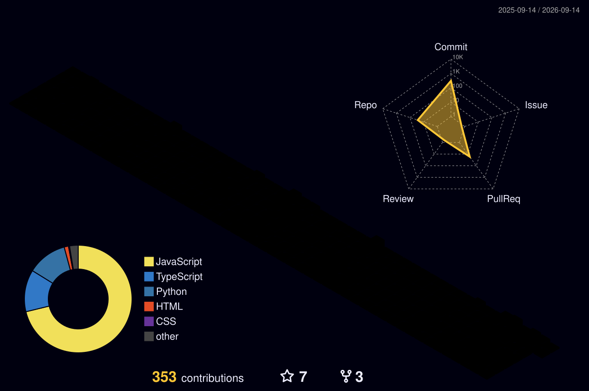

<!--
  ======================================================================
  DURVANKUR JOSHI — OFFICIAL DEVELOPER PROFILE
  AI Engineer & Full-Stack Developer
  ======================================================================
-->

<div align="center">

<!-- ====================================================================== -->
<!-- 01. HERO SECTION                                                       -->
<!-- ====================================================================== -->

<p align="center" style="font-family: monospace; color: #00F7FF; letter-spacing: 3px; margin-bottom: 2px;">
  &lt; HI, I'M /&gt;
</p>

# DURVANKUR JOSHI

<a href="https://git.io/typing-svg">
  
</a>

<br><br>

<p align="center">
  <code>[ Agentic AI ]</code> &nbsp; <code>[ Gen AI ]</code> &nbsp; <code>[ Full Stack ]</code> &nbsp; <code>[ Web3 ]</code>
</p>

<p align="center" style="color: #CBD5E1; font-size: 15px; margin-top: 6px;">
  <b>Building intelligent systems that ship.</b>
</p>

<p align="center">
  <a href="https://github.com/Durvankur-Joshi">
    
  </a>
  &nbsp;
  <a href="https://linkedin.com/in/Durvankur-Joshi" target="_blank">
    
  </a>
  &nbsp;
  <a href="https://YOUR_PORTFOLIO" target="_blank">
    
  </a>
  &nbsp;
  <a href="mailto:joshidurvankur.29@gmail.com">
    
  </a>
</p>

<table align="center" width="90%">
  <tr>
    <td bgcolor="#050816" style="border: 1px solid #1f2d6e; border-radius: 8px; padding: 12px 18px;">

```bash
$ whoami
durvankur-joshi

$ focus
agentic-ai + gen-ai + full-stack + web3

$ mission
build → ship → learn → repeat
```

  </td>
</tr>
</table>

</div>

<br>

<!-- ====================================================================== -->
<!-- 02. ABOUT / CURRENT MISSION                                            -->
<!-- ====================================================================== -->

## 👨‍💻 About / Current Mission

- 🎓 **Computer Engineering student** and **AI / Full-Stack developer** focused on building intelligent, scalable products.
- 🤖 Core expertise in **Agentic AI** (LangGraph, multi-agent execution graphs, RAG) and **Generative AI** application architectures.
- ⛓️ Actively developing in **Web3**, smart contracts, and privacy-preserving zero-knowledge concepts.
- 🏆 **Hackathon builder** driven by turning high-complexity concepts into robust, working software.

<br>

<table align="center" width="100%">
  <tr>
    <td bgcolor="#050816" style="border: 1px solid #1f2d6e; border-radius: 8px; padding: 14px 20px;">
      <span style="color: #00F7FF; font-weight: bold;">BUILD</span> <span style="color: #8B9CC7;">→</span> <span style="color: #F5F7FF;">AI-powered products</span> &nbsp;&bull;&nbsp; 
      <span style="color: #00FFA3; font-weight: bold;">EXPLORE</span> <span style="color: #8B9CC7;">→</span> <span style="color: #F5F7FF;">Agentic AI + GenAI + Web3</span> &nbsp;&bull;&nbsp; 
      <span style="color: #7F00FF; font-weight: bold;">LEARN</span> <span style="color: #8B9CC7;">→</span> <span style="color: #F5F7FF;">Advanced AI engineering</span> &nbsp;&bull;&nbsp; 
      <span style="color: #00F7FF; font-weight: bold;">SHIP</span> <span style="color: #8B9CC7;">→</span> <span style="color: #F5F7FF;">Real-world applications</span>
    </td>
  </tr>
</table>

<br>

<!-- ====================================================================== -->
<!-- 03. FEATURED PROJECTS                                                  -->
<!-- ====================================================================== -->

## 🚀 Featured Projects

<!-- PROJECT 1: MEDVAULT -->
<table width="100%">
  <tr>
    <td bgcolor="#050816" style="border-left: 4px solid #7F00FF; border-top: 1px solid #1f2d6e; border-right: 1px solid #1f2d6e; border-bottom: 1px solid #1f2d6e; border-radius: 8px; padding: 18px;">
      <h3 style="margin-top: 0; color: #00FFA3;">01. MedVault — Decentralized Medical History Ledger</h3>
      <p style="color: #CBD5E1; font-size: 14px; line-height: 1.5;">
        Privacy-first medical record sharing using blockchain, patient consent and zero-knowledge concepts.
      </p>
      <!-- Add project screenshot here:  -->
      <p>
        <code>Next.js</code> &bull; <code>FastAPI</code> &bull; <code>PostgreSQL</code> &bull; <code>Supabase</code> &bull; <code>Solidity</code> &bull; <code>Ethereum</code> &bull; <code>ZK</code>
      </p>
      <p>
        <a href="https://github.com/Durvankur-Joshi/medvault"></a>
        <a href="https://medvault-umber.vercel.app"></a>
      </p>
    </td>
  </tr>
</table>

<br>

<!-- PROJECT 2: AI DEBUGGING AGENT -->
<table width="100%">
  <tr>
    <td bgcolor="#050816" style="border-left: 4px solid #00F7FF; border-top: 1px solid #1f2d6e; border-right: 1px solid #1f2d6e; border-bottom: 1px solid #1f2d6e; border-radius: 8px; padding: 18px;">
      <h3 style="margin-top: 0; color: #00F7FF;">02. AI Debugging Agent</h3>
      <p style="color: #CBD5E1; font-size: 14px; line-height: 1.5;">
        AI-powered debugging system that understands repositories, retrieves relevant code and helps diagnose errors.
      </p>
      <!-- Add project screenshot here:  -->
      <p>
        <code>Python</code> &bull; <code>FastAPI</code> &bull; <code>LangGraph</code> &bull; <code>LangChain</code> &bull; <code>Hugging Face</code> &bull; <code>pgvector</code>
      </p>
      <p>
        <a href="https://github.com/Durvankur-Joshi/ai-debugging-agent"></a>
      </p>
    </td>
  </tr>
</table>

<br>

<!-- PROJECT 3: AI SOFTWARE COMPILER -->
<table width="100%">
  <tr>
    <td bgcolor="#050816" style="border-left: 4px solid #00FFA3; border-top: 1px solid #1f2d6e; border-right: 1px solid #1f2d6e; border-bottom: 1px solid #1f2d6e; border-radius: 8px; padding: 18px;">
      <h3 style="margin-top: 0; color: #00FFA3;">03. AI Software Compiler</h3>
      <p style="color: #CBD5E1; font-size: 14px; line-height: 1.5;">
        Transforms natural-language software requirements into structured application architecture.
      </p>
      <!-- Add project screenshot here:  -->
      <p>
        <code>Python</code> &bull; <code>FastAPI</code> &bull; <code>LLMs</code> &bull; <code>Pydantic</code> &bull; <code>Supabase</code>
      </p>
      <p>
        <a href="https://github.com/Durvankur-Joshi/ai-software-compiler"></a>
      </p>
    </td>
  </tr>
</table>

<br>

<!-- PROJECT 4 & 5 GRID -->
<table width="100%">
  <tr>
    <!-- CHATFUSION -->
    <td width="50%" bgcolor="#050816" style="border-top: 1px solid #1f2d6e; border-right: 1px solid #1f2d6e; border-bottom: 1px solid #1f2d6e; border-left: 3px solid #00F7FF; border-radius: 8px; padding: 16px; vertical-align: top;">
      <h4 style="margin-top: 0; color: #00F7FF;">04. ChatFusion</h4>
      <p style="color: #CBD5E1; font-size: 13.5px; line-height: 1.4;">Real-time chat application with interactive messaging.</p>
      <p><code>MERN</code> &bull; <code>Socket.IO</code></p>
      <a href="https://github.com/Durvankur-Joshi/chatfusion"></a>
    </td>
    <!-- CODEX -->
    <td width="50%" bgcolor="#050816" style="border-top: 1px solid #1f2d6e; border-right: 1px solid #1f2d6e; border-bottom: 1px solid #1f2d6e; border-left: 3px solid #7F00FF; border-radius: 8px; padding: 16px; vertical-align: top;">
      <h4 style="margin-top: 0; color: #00FFA3;">05. CodeX</h4>
      <p style="color: #CBD5E1; font-size: 13.5px; line-height: 1.4;">Browser-based online coding environment.</p>
      <p><code>React</code> &bull; <code>Node.js</code> &bull; <code>Express</code></p>
      <a href="https://github.com/Durvankur-Joshi/codex"></a>
    </td>
  </tr>
</table>

<br>

<!-- ====================================================================== -->
<!-- 04. TECH STACK                                                         -->
<!-- ====================================================================== -->

## 🛠️ Tech Stack

<table align="center" width="100%">
  <tr>
    <th width="24%" align="left" style="color: #00F7FF;">DOMAIN</th>
    <th width="76%" align="left" style="color: #00FFA3;">TECHNOLOGIES &amp; TOOLS</th>
  </tr>
  <tr>
    <td align="left"><b>💻 Languages</b></td>
    <td align="left">
      <a href="https://skillicons.dev">
        
      </a>
    </td>
  </tr>
  <tr>
    <td align="left"><b>🧠 AI / GenAI</b></td>
    <td align="left">
      
      
      
      
      
      
      
      
      
    </td>
  </tr>
  <tr>
    <td align="left"><b>🎨 Frontend</b></td>
    <td align="left">
      <a href="https://skillicons.dev">
        
      </a>
    </td>
  </tr>
  <tr>
    <td align="left"><b>⚙️ Backend</b></td>
    <td align="left">
      <a href="https://skillicons.dev">
        
      </a>
    </td>
  </tr>
  <tr>
    <td align="left"><b>🗄️ Database / Cloud</b></td>
    <td align="left">
      <a href="https://skillicons.dev">
        
      </a>
    </td>
  </tr>
  <tr>
    <td align="left"><b>⛓️ Web3</b></td>
    <td align="left">
      
      
      
      
      
    </td>
  </tr>
  <tr>
    <td align="left"><b>🛠️ Tools</b></td>
    <td align="left">
      <a href="https://skillicons.dev">
        
      </a>
    </td>
  </tr>
</table>

<br>

<!-- ====================================================================== -->
<!-- 05. SYSTEM ARCHITECTURE                                                -->
<!-- ====================================================================== -->

## 🧠 System Architecture

<p><em>Conceptual overview: How I approach modern AI and decentralized applications</em></p>

```text
                  USER
                    │
                    ▼
          ┌──────────────────┐
          │ Next.js / Client │
          └────────┬─────────┘
                   │
                   ▼
          ┌──────────────────┐
          │ API / FastAPI    │
          └────────┬─────────┘
                   │
                   ▼
       ┌─────────────────────────┐
       │      AI LAYER           │
       │                         │
       │ LLMs • Agents • RAG     │
       │ Tools • Memory          │
       └───────┬─────────┬───────┘
               │         │
               ▼         ▼
        ┌──────────┐  ┌──────────┐
        │ Database │  │  Web3    │
        │ Postgres │  │ EVM / ZK │
        └──────────┘  └──────────┘
```

<br>

<!-- ====================================================================== -->
<!-- 06. HACKATHONS & ACHIEVEMENTS                                          -->
<!-- ====================================================================== -->

## 🏆 Hackathons & Achievements

<table align="center" width="100%">
  <tr>
    <td bgcolor="#050816" style="border: 1px solid #1f2d6e; border-radius: 8px; padding: 16px;">
      <table width="100%" style="border-collapse: collapse;">
        <tr>
          <td width="8%" align="center" valign="middle"><h2>🥇</h2></td>
          <td width="92%">
            <h4 style="margin: 0; color: #FFD700;">Web Wizard Hackathon — Winner</h4>
            <p style="margin: 3px 0 0 0; color: #CBD5E1; font-size: 13.5px;">
              Earned 1st place for designing and building an end-to-end full-stack software prototype under timed hackathon constraints.
            </p>
          </td>
        </tr>
        <tr><td colspan="2"><hr style="border: none; border-top: 1px solid #15224e; margin: 10px 0;"></td></tr>
        <tr>
          <td width="8%" align="center" valign="middle"><h2>🌐</h2></td>
          <td width="92%">
            <h4 style="margin: 0; color: #00F7FF;">HackNexus'26 — Building MedVault</h4>
            <p style="margin: 3px 0 0 0; color: #CBD5E1; font-size: 13.5px;">
              Competed in Domain: Web3 &amp; Decentralized Applications, developing a Zero-Knowledge sovereign medical history ledger.
            </p>
          </td>
        </tr>
        <tr><td colspan="2"><hr style="border: none; border-top: 1px solid #15224e; margin: 10px 0;"></td></tr>
        <tr>
          <td width="8%" align="center" valign="middle"><h2>🛡️</h2></td>
          <td width="92%">
            <h4 style="margin: 0; color: #00FFA3;">Web Development Domain Head — Hackathon Club</h4>
            <p style="margin: 3px 0 0 0; color: #CBD5E1; font-size: 13.5px;">
              Leading technical workshops, mentoring developer cohorts, and guiding full-stack architecture for hackathon teams.
            </p>
          </td>
        </tr>
      </table>
    </td>
  </tr>
</table>

<br>

<!-- ====================================================================== -->
<!-- 07. GITHUB COMMAND CENTER                                              -->
<!-- ====================================================================== -->

<div align="center">

## 📡 GitHub Command Center

<table align="center" width="100%">
  <tr>
    <td width="50%" align="center" valign="top">
      
    </td>
    <td width="50%" align="center" valign="top">
      
    </td>
  </tr>
  <tr>
    <td colspan="2" align="center">
      
    </td>
  </tr>
</table>

<br>

<!-- ====================================================================== -->
<!-- 08. 3D CONTRIBUTION MATRIX + SNAKE GAME                                -->
<!-- ====================================================================== -->

## 🧊 3D Contribution Matrix

<picture>
  <source media="(prefers-color-scheme: dark)" srcset="profile-3d-contrib/profile-night-rainbow.svg">
  <source media="(prefers-color-scheme: light)" srcset="profile-3d-contrib/profile-night-rainbow.svg">
  
</picture>

<br><br>

## 🐍 Contribution Game

<picture>
  <source media="(prefers-color-scheme: dark)" srcset="https://raw.githubusercontent.com/Durvankur-Joshi/Durvankur-Joshi/output/github-contribution-grid-snake-dark.svg">
  <source media="(prefers-color-scheme: light)" srcset="https://raw.githubusercontent.com/Durvankur-Joshi/Durvankur-Joshi/output/github-contribution-grid-snake.svg">
  
</picture>

</div>

<br>

<!-- ====================================================================== -->
<!-- 09. CURRENTLY BUILDING                                                 -->
<!-- ====================================================================== -->

## 🟢 Currently Building

<!-- CURRENTLY_BUILDING_START -->
```text
AI Software Compiler
├─ Multi-agent architecture
├─ AI-assisted project planning
├─ Code generation
└─ Structured application architecture

NEXT:
MedVault improvements
```
<!-- CURRENTLY_BUILDING_END -->

<br>

<!-- ====================================================================== -->
<!-- 10. CONNECT                                                            -->
<!-- ====================================================================== -->

<div align="center">

## 📬 Let's Connect

<p style="font-size: 16px; color: #F5F7FF;"><strong>Let's build something interesting.</strong></p>

<br>

<p align="center">
  <a href="https://github.com/Durvankur-Joshi">
    
  </a>
  &nbsp;
  <a href="https://linkedin.com/in/Durvankur-Joshi" target="_blank">
    
  </a>
  &nbsp;
  <a href="https://YOUR_PORTFOLIO" target="_blank">
    
  </a>
  &nbsp;
  <a href="mailto:joshidurvankur.29@gmail.com">
    
  </a>
</p>

<br>

<!-- SUBTLE TERMINAL SESSION STATUS -->
<table align="center">
  <tr>
    <td bgcolor="#050816" align="center" style="border: 1px solid #1f2d6e; border-radius: 20px; padding: 6px 20px;">
      <span style="color: #00FFA3; font-family: monospace; font-size: 11.5px; letter-spacing: 1.5px;">
        ● SYS.SESSION_ACTIVE // DURVANKUR JOSHI // 2026
      </span>
    </td>
  </tr>
</table>

<br>

<p align="center">
  
</p>

</div>
